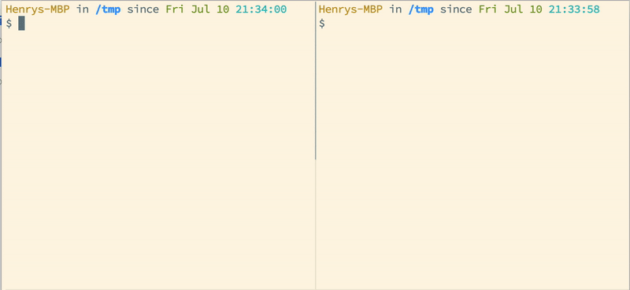

# ipcq

A simple inter-process communication (IPC) Queue built on top of the built-in library [multiprocessing](https://docs.python.org/3/library/multiprocessing.html).



* [Quick Start](#quick-start)
* [API](#api)
  + [class ipcq.QueueManagerServer](#class-ipcqqueuemanagerserver)
    - [Constructor](#constructor)
    - [Methods](#methods)
  + [class ipcq.QueueManagerClient](#class-ipcqqueuemanagerclient)
    - [Constructor](#constructor-1)
    - [Methods](#methods-1)

## Quick Start

**Server**

```
import ipcq


with ipcq.QueueManagerServer(address=ipcq.Address.DEFAULT, authkey=ipcq.AuthKey.DEFAULT) as server:
  server.get_queue().get()
```

**Client**

```
import ipcq


client = ipcq.QueueManagerClient(address=ipcq.Address.DEFAULT, authkey=ipcq.AuthKey.DEFAULT)
client.get_queue().put('a message')
```

Please checkout out the [examples](examples) folder for more examples.

## API

### class ipcq.QueueManagerServer

#### Constructor

The same with [multiprocessing.managers.BaseManager](https://docs.python.org/3/library/multiprocessing.html#multiprocessing.managers.BaseManager), please refer to it for more info.

`address` can be `ipcq.Address.AUTO` or `ipcq.Address.CWD`. When it's given `ipcq.Address.AUTO`, a random address will be chosen.
`ipcq.Address.CWD` means using a file that lives in the current working directory.

`authkey` is just like the password for authentication. It can be `ipcq.AuthKey.AUTO`, `ipcq.AuthKey.DEFAULT` or `ipcq.AuthKey.EMPTY`.

#### Methods

All methods in [multiprocessing.managers.BaseManager](https://docs.python.org/3/library/multiprocessing.html#multiprocessing.managers.BaseManager) are inherited.
The followings are the addtions.

**get_queue(ident: Optional[Union[AnyStr, int, type(None)]] = None) -> queue.Queue**

`ident` is the identity, it can be string-like objects, `int` or `None`. The default is `None`. This is for differetiate the obtained queues.

Return a queue corresponded with then `ident`.

### class ipcq.QueueManagerClient

#### Constructor

The same with [multiprocessing.managers.BaseManager](https://docs.python.org/3/library/multiprocessing.html#multiprocessing.managers.BaseManager), please refer to it for more info.

`address` can be `ipcq.Address.AUTO` or `ipcq.Address.CWD`. When it's given `ipcq.Address.AUTO`, a random address will be chosen.
`ipcq.Address.CWD` means using a file that lives in the current working directory.

`authkey` is just like the password for authentication. It can be `ipcq.AuthKey.AUTO`, `ipcq.AuthKey.DEFAULT` or `ipcq.AuthKey.EMPTY`.

#### Methods

All methods in [multiprocessing.managers.BaseManager](https://docs.python.org/3/library/multiprocessing.html#multiprocessing.managers.BaseManager) are inherited.
The followings are the addtions.

**get_queue(ident: Optional[Union[AnyStr, int, type(None)]] = None) -> queue.Queue**

`ident` is the identity, it can be string-like objects, `int` or `None`. The default is `None`. This is for differetiate the obtained queues.

Return a queue corresponded with then `ident`.
